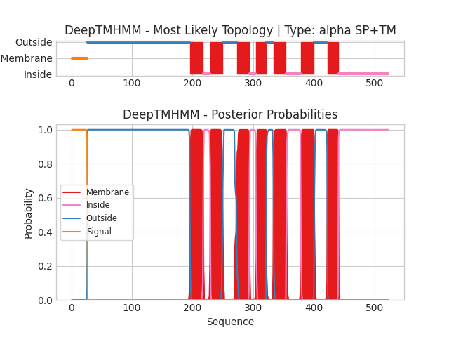

## DeepTMHMM - Predictions
Predicted topologies can be downloaded in [.gff3 format](TMRs.gff3) and [.3line format](predicted_topologies.3line)

You can download the probabilities used to generate this plot [here](AF-P32857-F1-model_v4_probs.csv)
### Predicted Topologies
```
>AF-P32857-F1-model_v4 | SP+TM
MRVYQFCRPFQLFTCFLCYLLVFVKANKEKISQKNYQVCAGMYSKEDWKGKIDPFISFNLKKISGLSDESDPGLVVAIYDFQDFEHLGVQLPDEEMYYICDDYAIDIGICEEENRDEFIVQDVVYDPYTSTNRSLANPIMTFSQNEVGLHDTRYPIKETGFYCVTAFRSSTSTKFNAVVNFRNAYGQLAGTEINKLPLYGLLAVAYVVAMALYSFAFWKHKHELLPLQKYLLAFFVFLTAETIFVWAYYDLKNEKGDTAGIKVYMVFLSILTAGKVTFSFFLLLIIALGYGIVYPKLNKTLMRRCQMYGALTYAICIGFLIQSYLTDMEAPSPLILITLIPMALALIIFYYMIIRSMTKTVIYLKEQRQIVKLNMYKKLLYIIYASFLSVLAGSIVSSFIYVGMNTIDMIEKNWRSRFFVTDFWPTLVYFIVFVTIAFLWRPTDTSYMLAASQQLPTDPENVADFDLGDLQSFDDQDDASIITGERGIDEDDLNLNFTDDEEGHDNVNNHSQGHGPVSPSPTK
SSSSSSSSSSSSSSSSSSSSSSSSSSOOOOOOOOOOOOOOOOOOOOOOOOOOOOOOOOOOOOOOOOOOOOOOOOOOOOOOOOOOOOOOOOOOOOOOOOOOOOOOOOOOOOOOOOOOOOOOOOOOOOOOOOOOOOOOOOOOOOOOOOOOOOOOOOOOOOOOOOOOOOOOOOOOOOOOOOOOOOOOOOOOOOOOOOOMMMMMMMMMMMMMMMMMMMMMMIIIIIIIIIIIIMMMMMMMMMMMMMMMMMMMMOOOOOOOOOOOOOOOOOOOOOOOMMMMMMMMMMMMMMMMMMMMMIIIIIIIIIIIMMMMMMMMMMMMMMMMMOOOOOOOOOOOOMMMMMMMMMMMMMMMMMMMMMIIIIIIIIIIIIIIIIIIIIIIIIMMMMMMMMMMMMMMMMMMMMMMOOOOOOOOOOOOOOOOOOOOOOMMMMMMMMMMMMMMMMMMIIIIIIIIIIIIIIIIIIIIIIIIIIIIIIIIIIIIIIIIIIIIIIIIIIIIIIIIIIIIIIIIIIIIIIIIIIIIIIIIIII

```


```
##gff-version 3
# AF-P32857-F1-model_v4 Length: 523
# AF-P32857-F1-model_v4 Number of predicted TMRs: 7
AF-P32857-F1-model_v4	signal	1	26				
AF-P32857-F1-model_v4	outside	27	195				
AF-P32857-F1-model_v4	TMhelix	196	217				
AF-P32857-F1-model_v4	inside	218	229				
AF-P32857-F1-model_v4	TMhelix	230	249				
AF-P32857-F1-model_v4	outside	250	272				
AF-P32857-F1-model_v4	TMhelix	273	293				
AF-P32857-F1-model_v4	inside	294	304				
AF-P32857-F1-model_v4	TMhelix	305	321				
AF-P32857-F1-model_v4	outside	322	333				
AF-P32857-F1-model_v4	TMhelix	334	354				
AF-P32857-F1-model_v4	inside	355	378				
AF-P32857-F1-model_v4	TMhelix	379	400				
AF-P32857-F1-model_v4	outside	401	422				
AF-P32857-F1-model_v4	TMhelix	423	440				
AF-P32857-F1-model_v4	inside	441	523				

```
